<<<<<<< HEAD:README.md
# inventario_soft2

 Equipo Los 3 Softweteros conformado por: 
1. Santiago Contreras Aristizabal
2. Juan Manuel Deutsch Torrado
3. Nicolás Vargas Wilches

Como se come?

En resumidas cuentas es una aplicación de gestión de inventario es una herramienta esencial para empresas que manejan productos físicos, ya que les permite administrar y supervisar sus existencias de manera eficiente. Acontinuacion presetamos una ampliación de las funciones clave de una aplicación de gestión de inventario:

**Creación de Productos:** La aplicación de gestión de inventario permite a los usuarios agregar información detallada sobre los productos que tienen en stock. Esto incluye datos como el nombre del producto, su descripción, número de serie, código de barras, categoría, precio, y cualquier otra información relevante.

**Actualización de Existencias:** La aplicación permite a los usuarios registrar las entradas y salidas de productos en el inventario.

**Búsqueda en una Aplicación de Gestión de Inventario:** La función de búsqueda en una aplicación de gestión de inventario permite a los usuarios encontrar rápidamente información sobre productos específicos dentro del inventario. Esto se logra generalmente mediante un cuadro de búsqueda en la interfaz de la aplicación.

¿Como ejecutarlo?

Mediante esta interfaz grafica a la cual se accede desde el siguiente link "http://localhost:8080/swagger-ui/index.html#/inventario-controller" el usuario tiene la posibilidad mediante los botones que se muestran a continuacion, de modifica, agregar y/o eliminar los datos que dese, el uso es bastante sencillo e intuitivo, solo necesita dar click en el boton que se adapte mas a su necesidad y realizar los cambios que decee. 

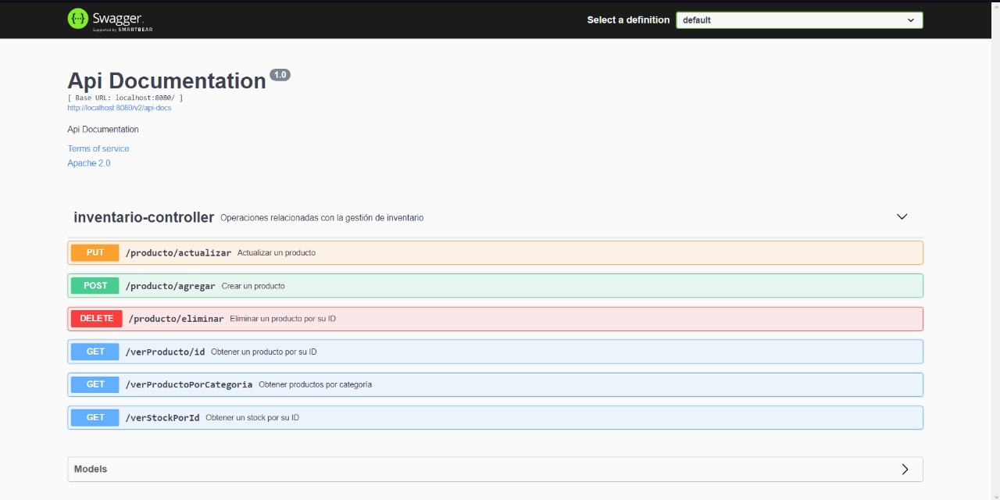

Supongamos que el usuario desea actualizar un producto, entonces le daria click al boton "PUT". al hacer click encima, se despliega el siguiente menu:

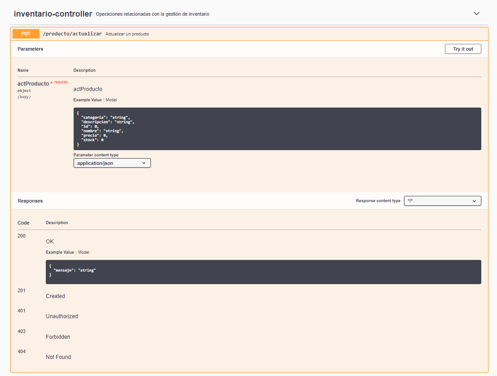

Para poder editar el contenido el usuario debe de dar click en el "botón Try it out" que esta ubicado en al esquina superior derecha como se muestra a continuación:

Segido a eso el usuario podra observar la pestaña para editar el registro en la Base de Datos. Por ejemplo podemos observar que el precio se duplico ya que en este caso se buscaba actualizar el precio del pantalon 

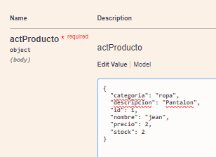, 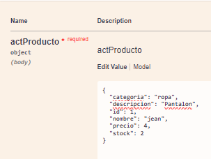

Una vez actuializados los datos necesarios le daremos al boton de "Execute" ubicado en la parte inferior: 

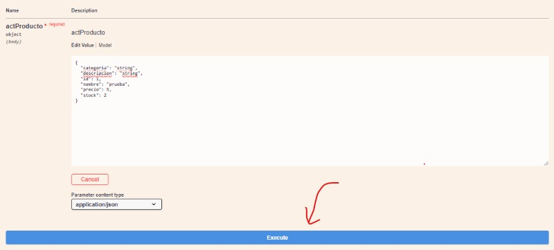

Despues de darle al boton "Execute" pueden ocurrir dos casos interesantes: 

Caso#1: El producto no se pudo actualizar debido a un error en la digitacion de los datos a actualizar, por lo que saldria el siguiente mensaje: 
git 
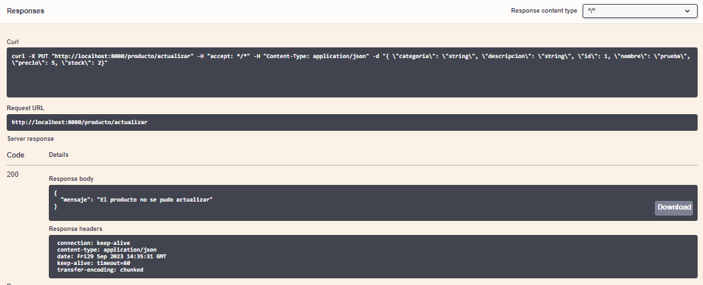

Caso#2: El producto se actualizo correctamente por lo que aparecera el siguiente mensaje: 

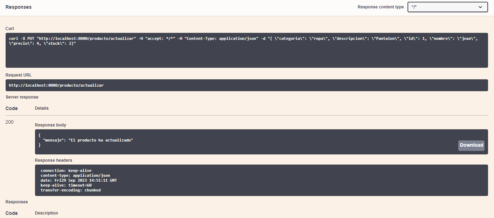

Finalmente se puede dar al boton de "cancel" ubicado en la esquina superior derecha para salir del modo "edit"

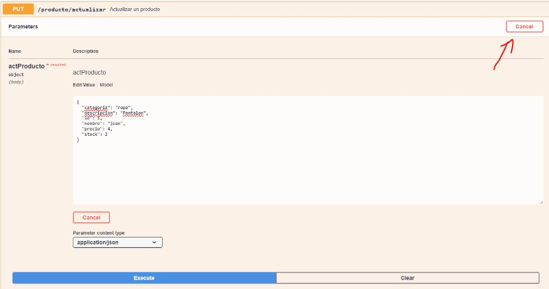

Una ves dado click volveremos a la pestaña principal, pero ahora, como podemos ver nuestro producto actualizado?. Para eso le daremos al boton "Get-verProductoPorCategoria"

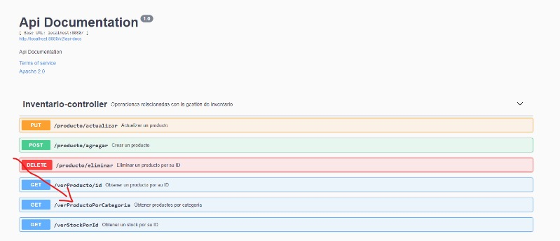

Desplegamos el menu y damos nuevamente al boton "try it out" para poder editar:

Una vez dentro colocaremos la categoria que le asignamos al pantalon que en este caso es "categoria=ropa", seguido a esto le daremos al boton de "Execute":

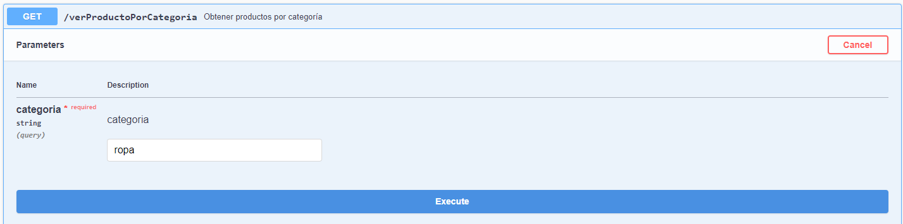

Despues de uan corta espera, podemos observar como nos paracesera nuestro producto actualizado y localizado por su categoria: 

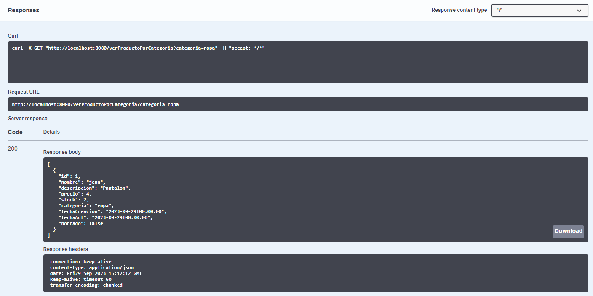

