# Inventario

 El equipo esta conformado por: 
1. Santiago Contreras Aristizabal
2. Juan Manuel Deutsch Torrado
3. Nicolás Vargas Wilches

## 1. ¿Que hace y como se come?

De manera resumida es una aplicación de gestión de inventario es una herramienta esencial para empresas que manejan productos físicos, ya que les permite administrar y supervisar sus existencias de manera eficiente. Acontinuacion presetamos una ampliación de las funciones clave de una aplicación de gestión de inventario:

**Creación de Productos:** La aplicación de gestión de inventario permite a los usuarios agregar información detallada sobre los productos que tienen en stock. Esto incluye datos como el nombre del producto, su descripción, número de serie, código de barras, categoría, precio, y cualquier otra información relevante.

**Actualización de Existencias:** La aplicación permite a los usuarios registrar las entradas y salidas de productos en el inventario.

**Búsqueda en una Aplicación de Gestión de Inventario:** La función de búsqueda en una aplicación de gestión de inventario permite a los usuarios encontrar rápidamente información sobre productos específicos dentro del inventario. Esto se logra generalmente mediante un cuadro de búsqueda en la interfaz de la aplicación.

## 2. ¿Como ejecutarlo?
### 2.1 Swagger

Mediante esta interfaz grafica a la cual se accede desde el siguiente link "http://localhost:8080/swagger-ui/index.html#/inventario-controller" el usuario tiene la posibilidad mediante los botones que se muestran a continuacion, de modifica, agregar y/o eliminar los datos que dese, el uso es bastante sencillo e intuitivo, solo necesita dar click en el boton que se adapte mas a su necesidad y realizar los cambios que decee.

Supongamos que el usuario desea actualizar un producto, entonces le daria click al boton "PUT". al hacer click encima, se despliega el siguiente menu:

Para poder editar el contenido el usuario debe de dar click en el "botón Try it out" que esta ubicado en al esquina superior derecha como se muestra a continuación:

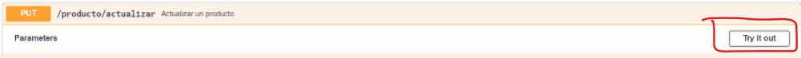

Segido a eso el usuario podra observar la pestaña para editar el registro en la Base de Datos. Por ejemplo podemos observar que el precio se duplico ya que en este caso se buscaba actualizar el precio del pantalon 

, 

Una vez actuializados los datos necesarios le daremos al boton de "Execute" ubicado en la parte inferior: 

Despues de darle al boton "Execute" pueden ocurrir dos casos interesantes: 

Caso#1: El producto no se pudo actualizar debido a un error en la digitacion de los datos a actualizar, por lo que saldria el siguiente mensaje:

Caso#2: El producto se actualizo correctamente por lo que aparecera el siguiente mensaje: 

Finalmente se puede dar al boton de "cancel" ubicado en la esquina superior derecha para salir del modo "edit"

Una ves dado click volveremos a la pestaña principal, pero ahora, como podemos ver nuestro producto actualizado?. Para eso le daremos al boton "Get-verProductoPorCategoria"

Desplegamos el menu y damos nuevamente al boton "try it out" para poder editar:

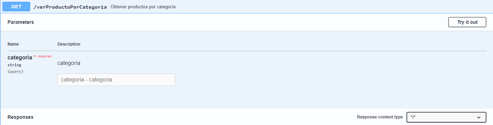

Una vez dentro colocaremos la categoria que le asignamos al pantalon que en este caso es "categoria=ropa", seguido a esto le daremos al boton de "Execute":

Despues de uan corta espera, podemos observar como nos paracesera nuestro producto actualizado y localizado por su categoria: 

## 2.2 Una segunda forma de ejecutarlo
Ademas de la documentacion de Swagger para poder ejecutarlo, se tiene el cliente de postman en el cual desde un principio se empezaron a realizar las pruebas. Siguiendo el mismo orden de ideas de Swagger obtenemos que podemos añadir, actalizar, eliminar de manera logica, ver el producto por ID, ver el productos por medio de su categoria y por ultimo ver el stock de un producto por su ID

### 2.2.1 Agregar producto
Para agregar un producto dentro de postman, primero se tiene que poner el url de la funcionabilidad el cual es http://localhost:8080/producto/agregar donde tambien se nombra el puerto en donde esta ejecutandose el aplicativo, luego se tiene que poner en el apartado de body y cambiar el formato a JSON, donde luego se nombran las variables y luego se les da su valor, ya sea de int o de string. Dentro de la creacion del producto tenemos que se genera automaticamente la fecha de creacion, la fecha de actualizacion y un estado de borrado logico. Luego de que las variables esten correctamente escritas se hace click en el boton de send y se crea el producto en la base de datos
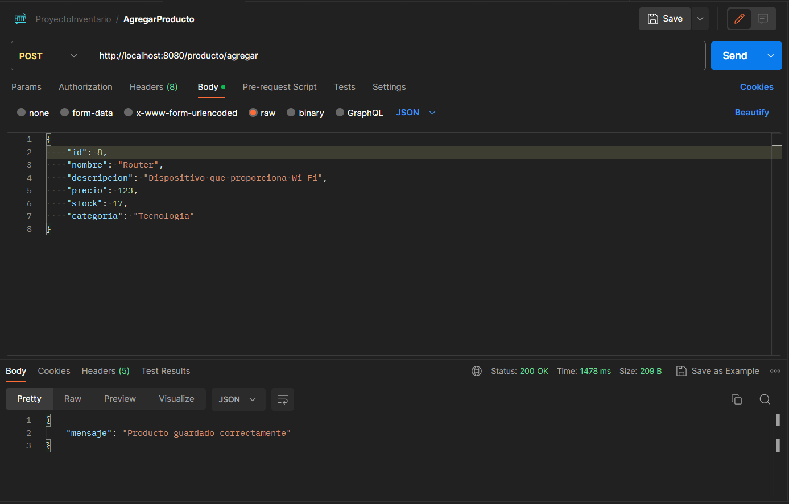
Aqui tenemos la vista desde la base de datos, donde el último producto fue el que se creo
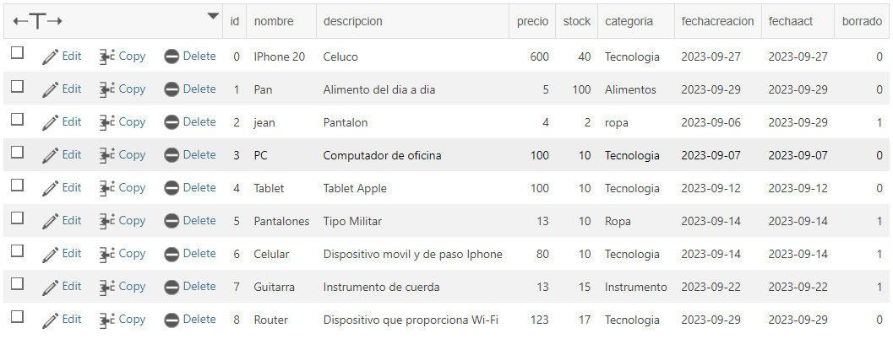
### 2.2.2 Actualizar producto
Para actualizar un producto dentro de postman se tiene que seguir las mismas intrucciones las cuales se comentaron en agregar, las cuales son el url que es http://localhost:8080/producto/actualizar que sigue el orden de nombrar el puerto el cual se ejecuta la aplicacion luego se tiene que poner en el apartado de body y cambiar el formato a JSON, donde se vuelven a nombrar las variables y se les actualiza su valor, donde de los valores autogenerados se actualiza la fecha de actualización
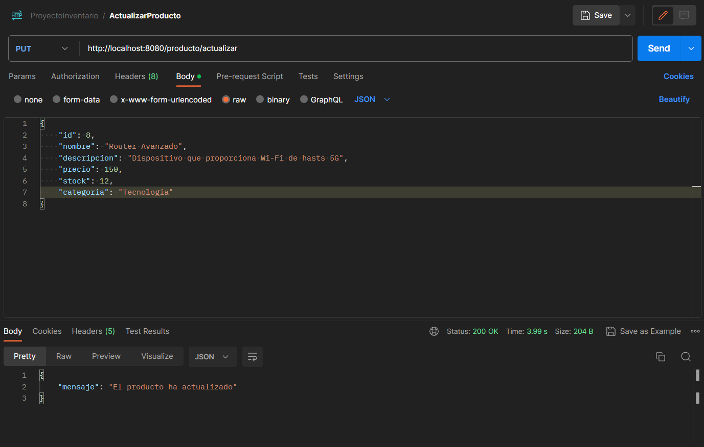
Aquí tenemos la vista del producto actualizado desde la base de datos
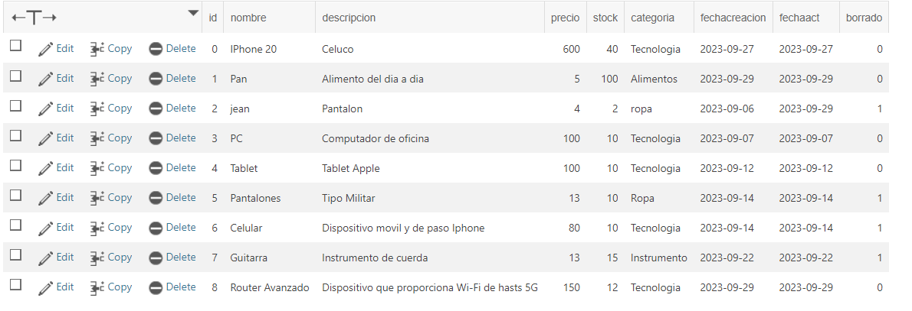
### 2.2.3 Ver producto por ID
Para poder ver un producto por medio de su ID tenemos que digitar el siguiente url http://localhost:8080/verProducto/id?id=8 teniendo en cuenta que estamos viendo el producto de ID 8, luego dentro de params obtenemos que se genera en key y en value unos datos, los cuales son los que aparecen en el URL, para simplemente clickear en send y se genere el mensaje del producto que esperamos
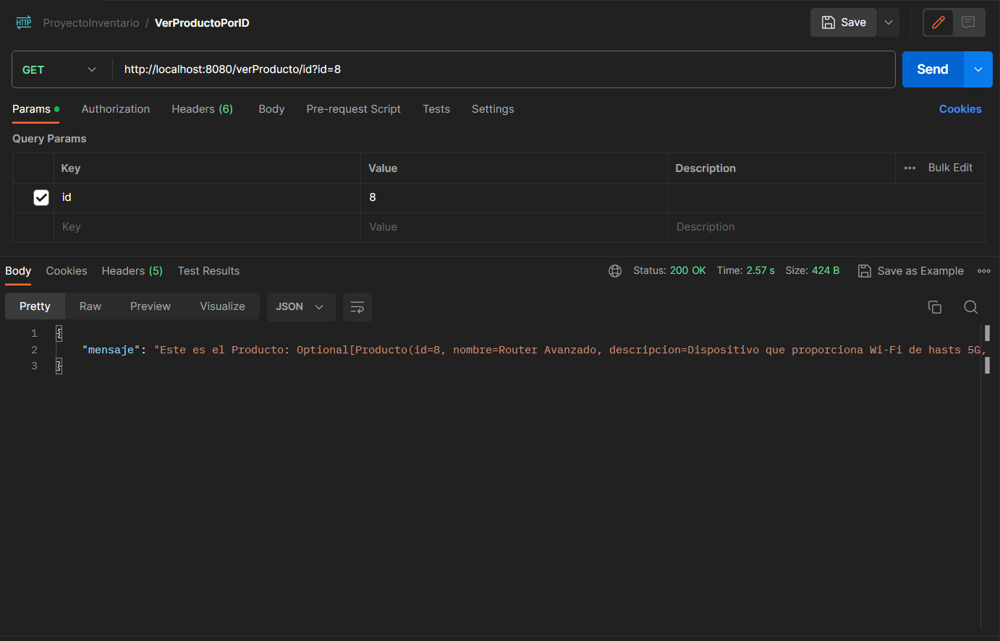
### 2.2.4 Ver productos por su categoria
Para poder ver los productos de una sola categoria tenemos que seguir las mismas instrucciones de ver por ID con diferencia de ?categoria= como se presenta en el siguiente url http://localhost:8080/verProductoPorCategoria?categoria=Tecnologia donde no solo mostrara un producto sino todos los procutos de la misma categoria, mostrandonos también el mismo producto el cual hemos estado trabajando en esta documentacion
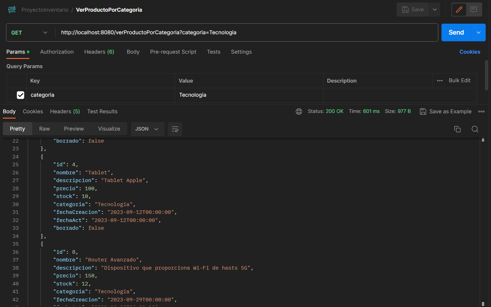
### 2.2.5 Ver stock del producto por su ID
Para poder ver el stock de un producto tenemos que seguir también las intrucciones de ver por ID, la unica diferencia es el url que nos muestra es el stock http://localhost:8080/verStockPorId?id=8
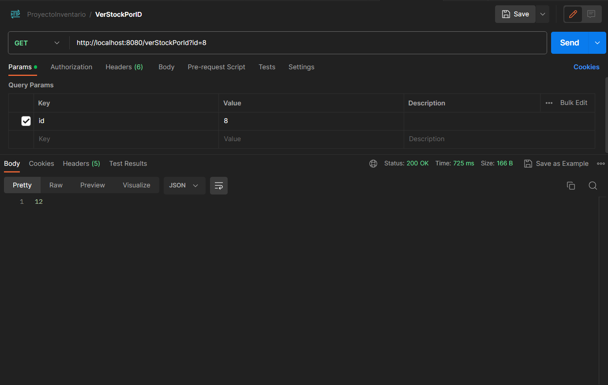
### 2.2.6 Eliminar producto (De manera logica)
Finalizando con el borrado obtenemos que solo necesitamos el ID para efectuar esta funcionabilidad, usando el siguiente url http://localhost:8080/producto/eliminar?id=8 usando el mismo producto con el que hemos estado usando, pero el corazon de la funcionabilidad recae que no se elimina de una manera brutal de la base de datos, sino que por medio de un booleano donde false es que el producto existe y true es que el producto se borró, pero si revisamos dentro de la base de datos sigue "existiendo". Este tipo de borrado logico se usa para eliminar datos de manera controlada y reversible por lo que teoricamente nunca se ha borrado el producto dentro de la base de datos, no obstante se usa una logica para que se muestre de esa manera
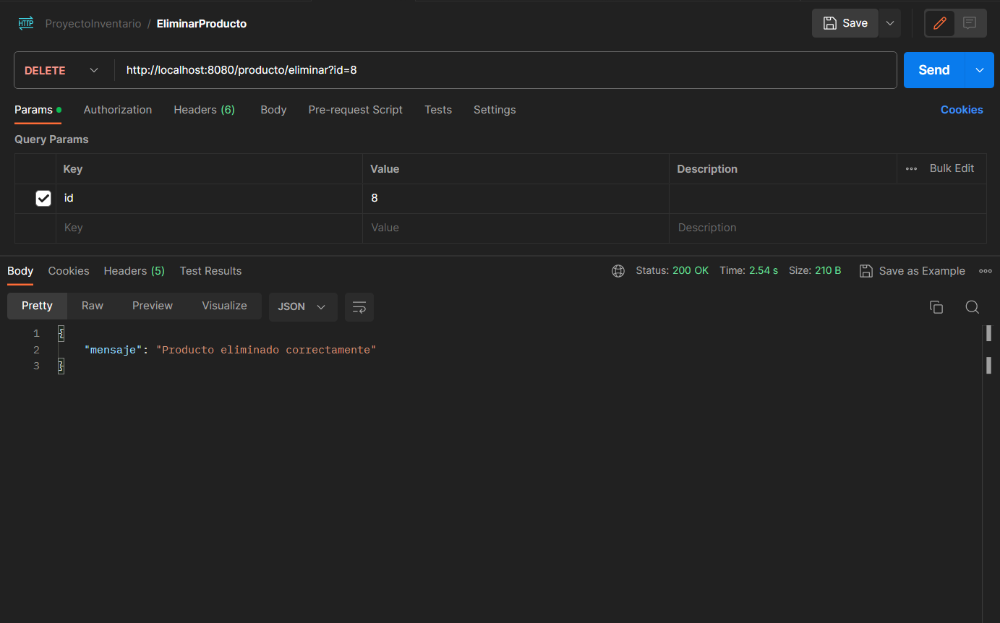
Aquí obtenemos la vista desde la base de datos, en donde la última columna esta en 1 y 0 donde 1 es que el producto se borró
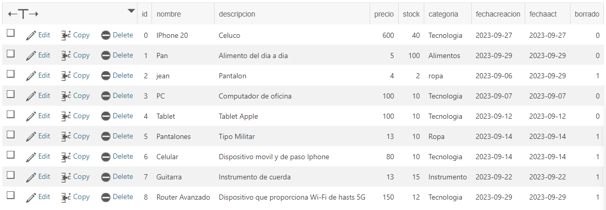

El archivo .json para poder importar al Postman se encuentra en *docs/ProyectoInventario.postman_collection.json*

## 3. Coverage
Dentro de los test que se realizaron se propuso tener un coverage de 85% el cual se puede verificar por medio de JaCoCo (Java Code Coverage) el cual es un proyecto de código abierto el cual es utilizado para verificar la cobertura del codigo y usando mutation test el cual se utiliza para diseñar nuevas pruebas de software y evaluar la calidad de las pruebas ya existentes, esto para verificar que los test tengan fuerza
### 3.1 Jacoco
El uso de Jacoco fue principalmente para verificar que tanto coverage proporcionaban nuestras pruebas, excuyendo clases las cuales no se podian testear, como los DTO o toda la carpeta de BD, verificando la logica y el controlador siendo pruebas unitarias y pruebas de integracion respectivamente. También se puede ver el coverage de los test por medio Github Acctions por el workflow de JaCoCo Coverage
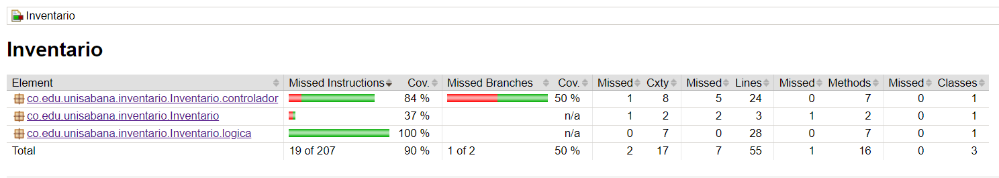
Para poder ver el Jacoco nos debemos dirigir a *build/reports/jacoco/test/html/index.html* y escoger el navegador que queremos usar para ver el coverage
### 3.2 Mutation Test
El uso de Mutation test fue para verificar la fuerza de nuestros test, pero que hace mutation test, lo que realiza es medir la efectividad de las pruebas identificando la capacidad del conjunto de pruebas para detectar defectos en el código fuente, y ya dicho anteriormente, para verificar la fuerza de nuestros test
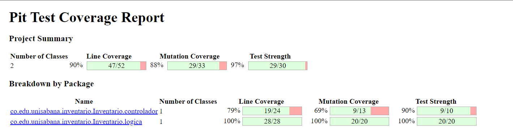
Para poder ver el coverage del Mutation Test no tenemos que dirigir a *build/reports/pitest/202309291430/index.html* y escoger el navegador que queremos usar para ver el coverage